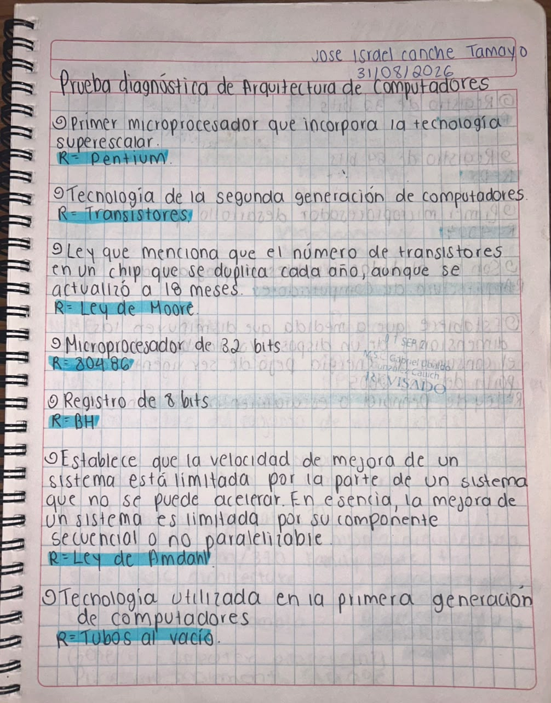
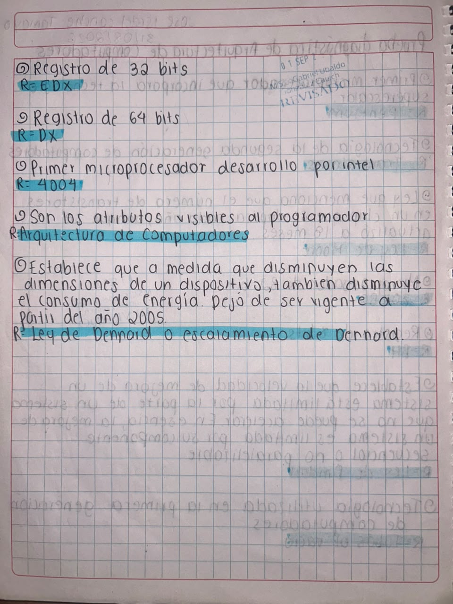
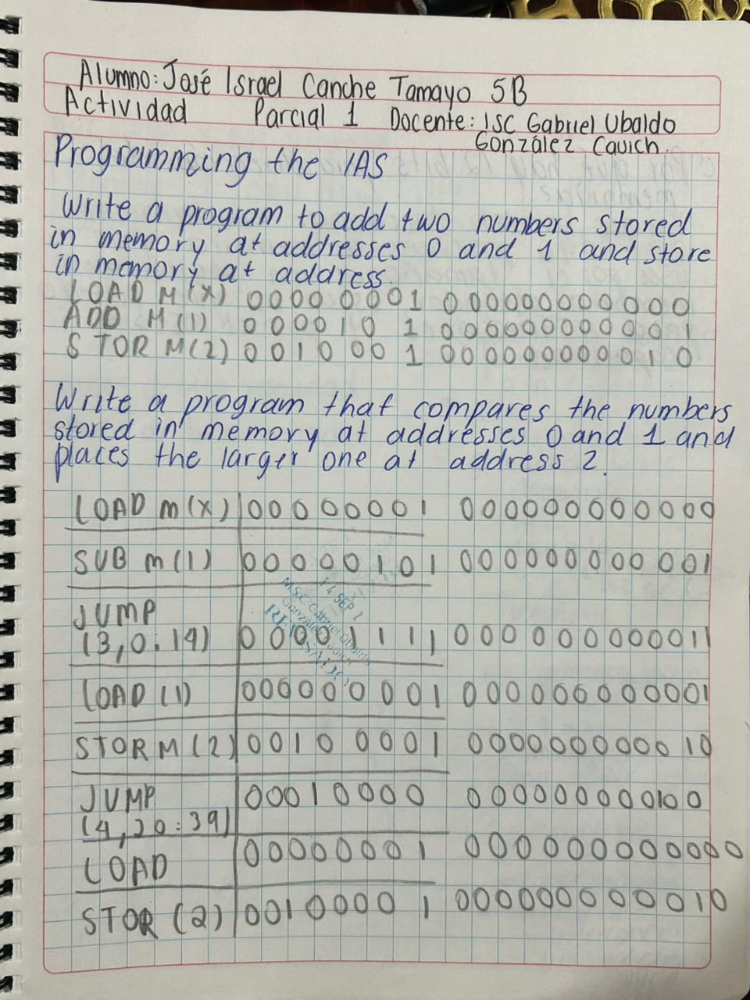
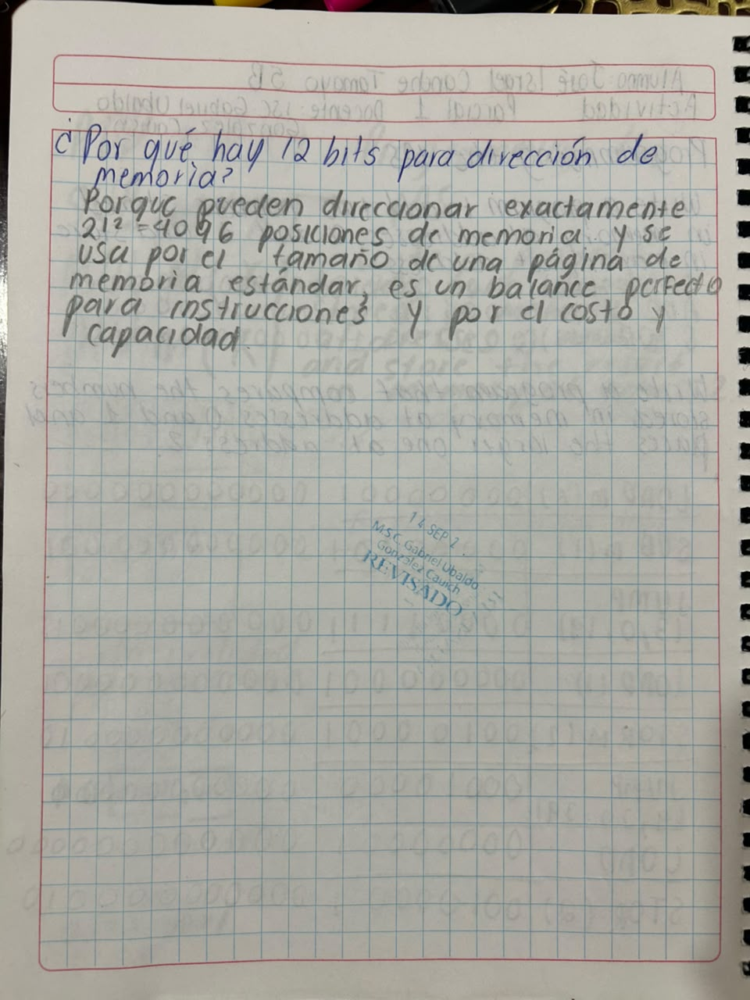
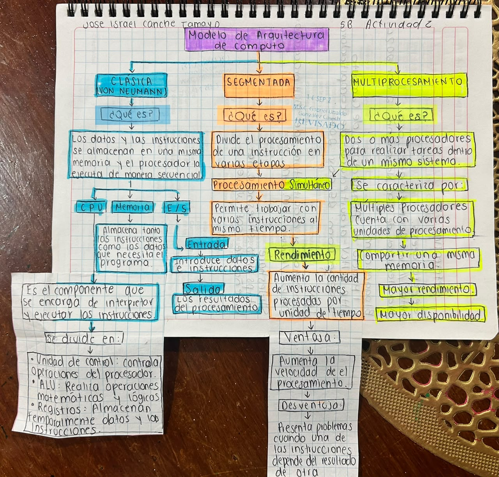
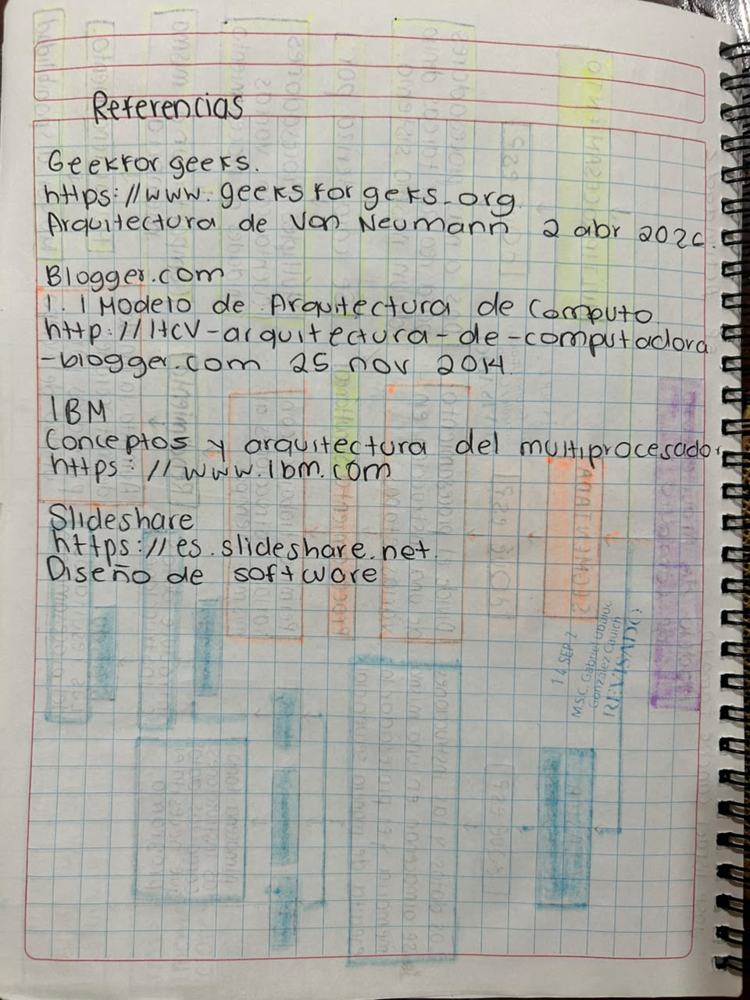
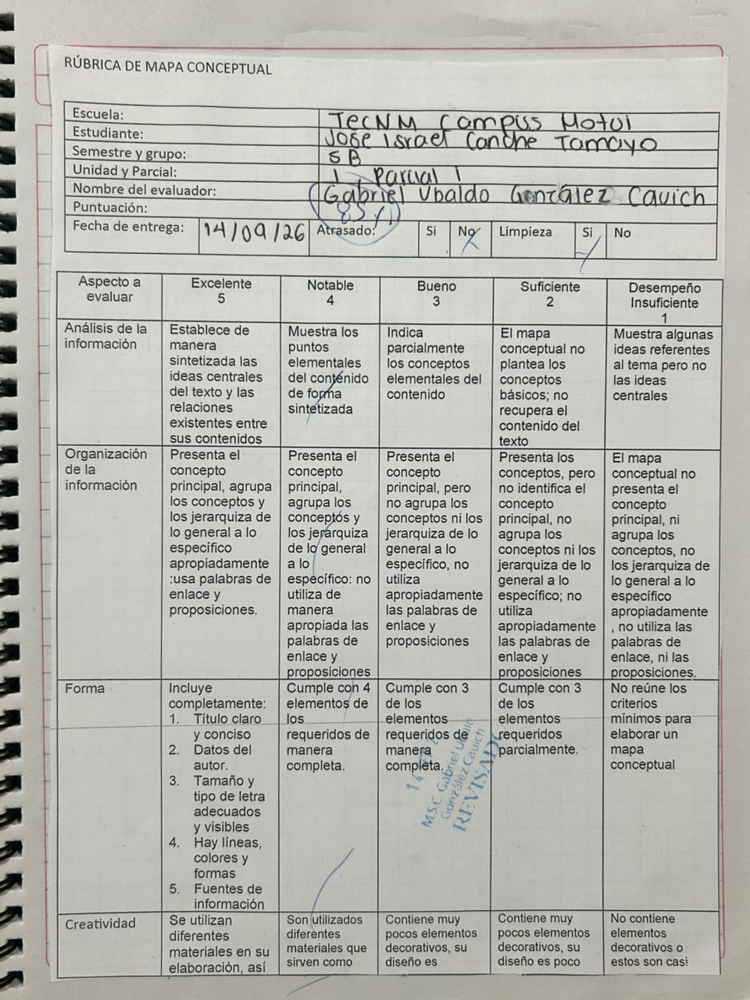
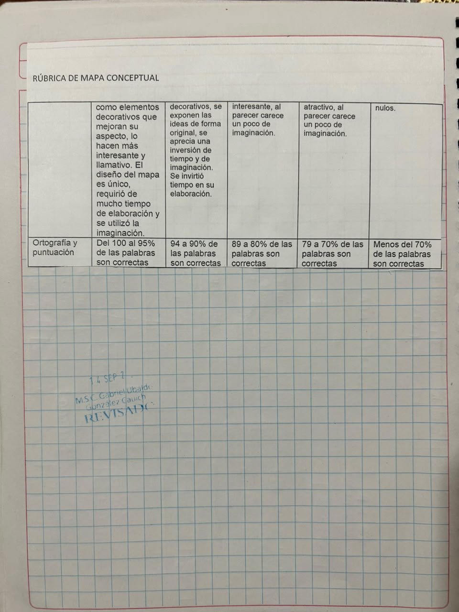
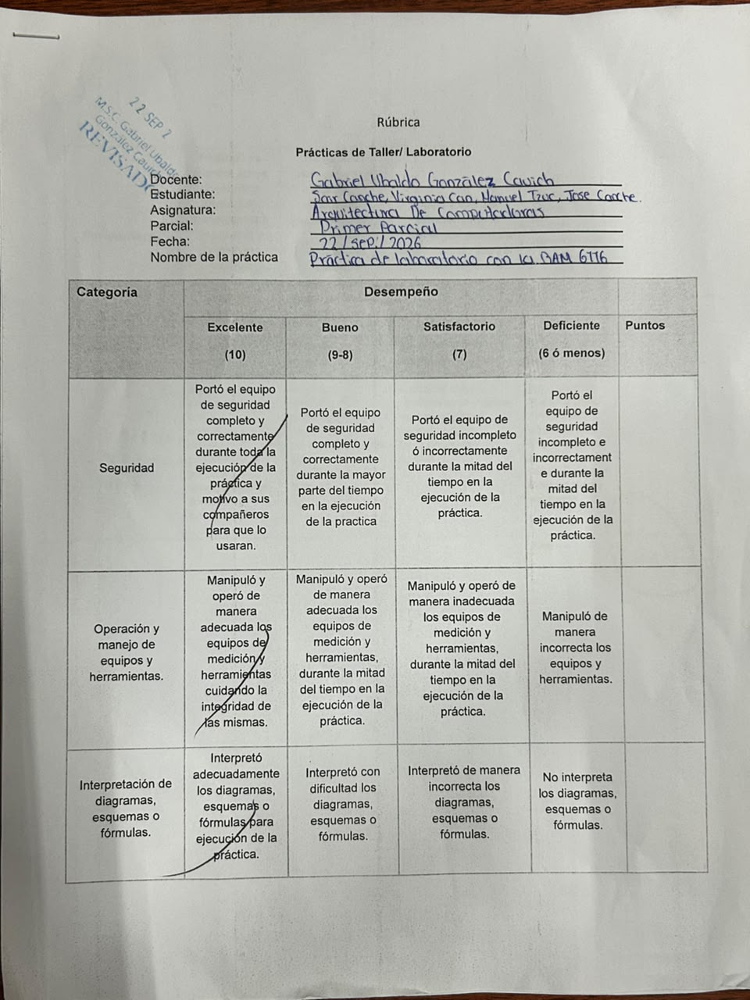
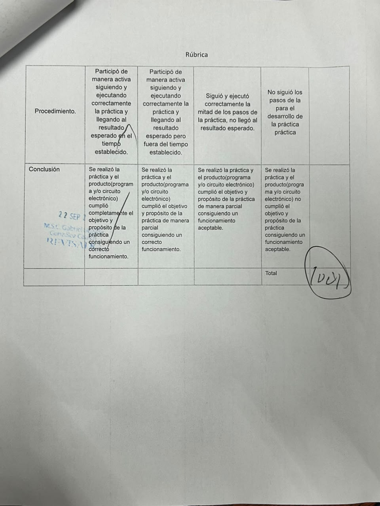

# Portafolio de Evidencias - Unidad 1

## Arquitectura de Computadoras
**Alumno:** Jose Israel Canche Tamayo 
**Semestre y grupo:** 5B  
**Materia:** Arquitectura de Computadoras  
**Docente:** Gabriel Ubaldo González Cauich  
**Unidad:** 1  
**Actividad:** Portafolio de Evidencias  
**Período:** 2026-B  

*Motul, Yucatán, México; 23 de septiembre de 2026*

---

# Introducción
El presente portafolio de evidencias reúne de forma organizada el trabajo, las actividades y los proyectos desarrollados a lo largo de la Unidad 1 de la asignatura Arquitectura de Computadoras. A través de este compendio, se busca dar visibilidad al proceso de aprendizaje mediante el cual se exploraron los principios clave de la organización y el funcionamiento interno de los sistemas de cómputo.

---

# Objetivo del portafolio
El propósito principal es reunir y ordenar todo lo que hice en la Unidad 1 para ver el avance que tuve y los conocimientos que logré adquirir.

También me sirve para analizar los errores que tuve en las prácticas y ejercicios, entender qué fue lo que falló y tomar nota de cómo puedo hacer un mejor trabajo la próxima vez.

---

# Índice(Contenido)

1. [Prueba diagnóstica](#1-prueba-diagnóstica)
2. [Programación de la IAS](#2-programación-de-la-ias)
3. [Mapa conceptual de modelos de arquitectura de cómputo](#3-mapa-conceptual-de-modelos-de-arquitectura-de-cómputo)
4. [Práctica de memoria RAM 6116](#4-práctica-de-memoria-ram-6116)
5. [Reflexión general de la unidad](#reflexión-general-de-la-unidad)
6. [Conclusión](#conclusión)

---

# 1. Prueba diagnóstica

## Descripción de la actividad
Fue la primera actividad que hicimos en la materia y sirvió para medir qué tanto sabíamos antes de empezar de lleno con los temas.

Venían preguntas sobre el uso de registros (de 8, 32 y 64 bits), las generaciones de las computadoras, leyes importantes como la de Moore, Amdahl y Dennard, además de algunos procesadores conocidos y conceptos generales de hardware.

## Evidencia

## ¿Qué aprendí?
Recordé varios conceptos básicos, pero también me di cuenta de que necesitaba repasar más a fondo la historia de los procesadores y el impacto que tienen las leyes tecnológicas en su desarrollo.

También me permitió tener una idea de los temas que se trabajarían posteriormente durante la unidad.

## Errores y aspectos por mejorar
Al ser una prueba rápida, me di cuenta de que a veces me confundía con algunos términos teóricos de la arquitectura de computadoras.

No debo aprenderme las definiciones de memoria. Es mejor intentar comprender para qué sirve cada componente dentro del sistema y cómo se conecta con lo demás.

---

# 2. Programación de la IAS

## Descripción de la actividad

En esta actividad trabajamos con el modelo de la computadora IAS para entender cómo el procesador lee y ejecuta instrucciones paso a paso desde la memoria.

Un programa para sumar dos números almacenados en memoria usando órdenes básicas como LOAD, ADD y STOR.

Un programa para comparar dos números y guardar únicamente el más grande en otra casilla de memoria.

Una pregunta extra para analizar cómo se manejan las direcciones de memoria en este modelo.

## Evidencias

### Programa para sumar dos números

### Pregunta extra

## ¿Qué aprendí?
Entendí de forma más clara cómo la computadora procesa las instrucciones que tiene guardadas. Con la suma vi cómo funciona el flujo de traer un dato (LOAD), operarlo (ADD) y guardarlo (STOR).

El ejercicio de comparación me hizo pensar un poco más en la lógica, ya que tuve que plantear una condición para decidir qué instrucción debía ejecutarse según cuál número fuera el mayor.

## Errores y aspectos por mejorar
Pues prácticamente el error fue nulo, tuve que checar con verificación que no se me pase algun 0 demás.  

---

# 3. Mapa conceptual de modelos de arquitectura de cómputo

## Descripción de la actividad
Diseñé un mapa conceptual para organizar de forma visual los principales modelos de arquitectura que existen:

La arquitectura clásica o Von Neumann.

La arquitectura segmentada.

La arquitectura de multiprocesamiento.

También agregué cómo se conectan los elementos internos como la CPU, la Unidad de Control, la ALU, los registros, la memoria y las entradas/salidas, destacando los puntos fuertes y débiles de cada modelo. 

## Evidencia

## ¿Qué aprendí?
Hacer el mapa me ayudó muchísimo a conectar los puntos. Antes veía la CPU, los registros o la memoria como temas separados, pero al acomodarlos visualmente entendí cómo trabajan juntos en el ciclo de instrucciones.

Además, comprendí que no hay una arquitectura "perfecta", sino que cada modelo tiene sus ventajas según lo que se necesite hacer.

## Errores y aspectos por mejorar
Mi mayor reto fue no saturar el mapa con tanto texto y lograr que las relaciones entre conceptos principales y secundarios se entendieran a la primera.

Para mejorar: Hacer un borrador previo clasificando la información en ideas clave antes de armar el diseño final. Así el mapa queda mucho más limpio y fácil de leer.

---

# 4. Práctica de memoria RAM 6116

## Descripción de la actividad
Montamos un circuito físico en protoboard utilizando un chip de memoria RAM estática 6116 para hacer ejercicios reales de lectura y escritura de datos.

Utilizamos componentes como la memoria 6116, protoboard, microswitches, botones, un display de 7 segmentos, resistencias, LEDs, integrados auxiliares y bastante cable de conexión.

## Evidencia

[Ver reporte de la práctica de RAM 6116](ReporteRAM6116.pdf)

## ¿Qué aprendí?
Esta práctica fue clave para entender cómo se escriben y leen los datos en la vida real y no solo en la libreta.

Tuvimos bastantes tropiezos al inicio. La primera vez intentamos armar el circuito guiándonos solo por fotos de cómo se veía, pero cometimos el error de no analizar qué hacía cada conexión, así que no funcionó. Decidimos desarmar todo, empezar desde cero y esta vez usar el diagrama de conexiones y la hoja de datos (datasheet) del chip. Además, se nos dañaron algunos componentes del display que tuvimos que cambiar. Al final, logramos que todo encendiera y funcionara correctamente.

## Errores y aspectos por mejorar
El error principal fue querer armar todo rápido confiándonos de la apariencia de las fotos en vez de entender el diagrama lógico. Eso hizo que perderíamos tiempo tratando de adivinar qué estaba fallando.

Para mejorar: En las siguientes prácticas en laboratorio, primero voy a revisar el diagrama, leer el datasheet de los componentes y verificar las conexiones con calma antes de conectar la corriente.

---

# Reflexión general de la unidad
Esta primera unidad me sirvió bastante para unir la teoría con la práctica. Pasar de las preguntas del diagnóstico a la lógica de la IAS, luego a la organización del mapa conceptual y finalmente a conectar cables en la protoboard con la RAM 6116 hizo que las cosas cobraran mucho más sentido.

La lección más grande que me llevo no es solo cómo funciona una memoria, sino la importancia de ser metódica. En la práctica con el chip 6116 me di cuenta de que no sirve de nada intentar hacer las cosas "a ojo"; hay que entender el diagrama y saber qué función cumple cada parte.

Los errores que cometimos durante las actividades terminaron siendo de bastante ayuda, porque al buscar cómo solucionarlos fue cuando realmente entendí el tema.

---

# Conclusión
Siento que cierro la Unidad 1 con una base sólida sobre la estructura de las computadoras. Cada trabajo aportó algo diferente: la IAS me enseñó sobre instrucciones de bajo nivel, el mapa sobre cómo se estructuran las arquitecturas y la RAM 6116 sobre el comportamiento físico del hardware.

Me quedo con aprendizajes claros sobre lo que debo mejorar para las siguientes unidades: analizar mejor los problemas antes de empezar a armar o programar, revisar los diagramas con cuidado y ser más ordenada al trabajar.

---
